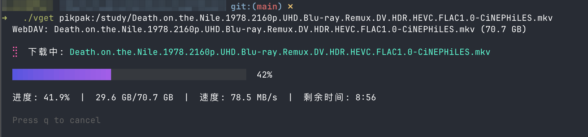

# vget

Versatile command-line toolkit for downloading audio, video, podcasts, and more.

[简体中文](README_zh.md) | [日本語](README_jp.md) | [한국어](README_kr.md) | [Español](README_es.md) | [Français](README_fr.md) | [Deutsch](README_de.md)

## Installation

### macOS

```bash
curl -fsSL https://github.com/guiyumin/vget/releases/latest/download/vget-darwin-arm64.zip -o vget.zip
unzip vget.zip
sudo mv vget /usr/local/bin/
rm vget.zip
```

### Linux / WSL

```bash
curl -fsSL https://github.com/guiyumin/vget/releases/latest/download/vget-linux-amd64.zip -o vget.zip
unzip vget.zip
sudo mv vget /usr/local/bin/
rm vget.zip
```

### Windows

Download `vget-windows-amd64.zip` from [Releases](https://github.com/guiyumin/vget/releases/latest), extract it, and add to your PATH.

## Screenshots

### Download Progress



## Supported Sources

See [sites.md](sites.md) for the full list of supported sites.

## Commands

| Command                            | Description                           |
| ---------------------------------- | ------------------------------------- |
| `vget [url]`                       | Download media (`-o`, `-q`, `--info`) |
| `vget ls <remote>:<path>`          | List remote directory (`--json`)      |
| `vget init`                        | Interactive config wizard             |
| `vget update`                      | Self-update (use `sudo` on Mac/Linux) |
| `vget search --podcast <query>`    | Search podcasts                       |
| `vget completion [shell]`          | Generate shell completion script      |
| `vget config show`                 | Show config                           |
| `vget config path`                 | Show config file path                 |
| `vget config webdav list`          | List configured WebDAV servers        |
| `vget config webdav add <name>`    | Add a WebDAV server                   |
| `vget config webdav show <name>`   | Show server details                   |
| `vget config webdav delete <name>` | Delete a server                       |
| `vget telegram login --import-desktop` | Import Telegram session from desktop app |

### Examples

```bash
vget https://twitter.com/user/status/123456789
vget https://www.xiaoyuzhoufm.com/episode/abc123
vget https://www.xiaohongshu.com/explore/abc123  # XHS video/image
vget https://example.com/video -o my_video.mp4
vget --info https://example.com/video
vget search --podcast "tech news"
vget pikpak:/path/to/file.mp4              # WebDAV download
vget ls pikpak:/Movies                     # List remote directory
```

## Configuration

Config file location:

| OS          | Path                        |
| ----------- | --------------------------- |
| macOS/Linux | `~/.config/vget/config.yml` |
| Windows     | `%APPDATA%\vget\config.yml` |

Run `vget init` to create the config file interactively, or create it manually:

```yaml
language: en # en, zh, jp, kr, es, fr, de
```

## Updating

To update vget to the latest version:

**macOS / Linux:**

```bash
sudo vget update
```

**Windows (run PowerShell as Administrator):**

```powershell
vget update
```

## Languages

vget supports multiple languages:

- English (en)
- 中文 (zh)
- 日本語 (jp)
- 한국어 (kr)
- Español (es)
- Français (fr)
- Deutsch (de)

## License

Apache License 2.0
