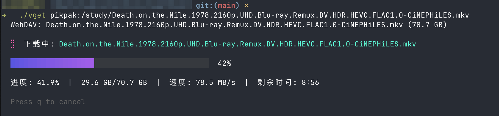

# vget

A small, focused downloader for media links and WebDAV resource libraries. Available as CLI and Docker.

[简体中文](README_zh.md) | [日本語](README_jp.md) | [한국어](README_kr.md) | [Español](README_es.md) | [Français](README_fr.md) | [Deutsch](README_de.md) | [Português](README_pt.md)

## What it is

vget is a thin, simple interface over the resources behind it. Point it at a link or a WebDAV resource library and it fetches the file — with a progress bar in the terminal, or a web UI on your NAS.

The tool stays deliberately small. The value isn't the downloader; it's the resource libraries it connects to. So vget speaks standard protocols instead of scraping — it doesn't break when a site changes its markup, and any WebDAV server anyone runs becomes a library it can browse and pull from.

- **Media links** — Twitter/X (video/image), podcasts (Xiaoyuzhou, Apple Podcasts), direct file URLs, m3u8/HLS streams
- **WebDAV resource libraries** — PikPak, a NAS, a seedbox, or anyone's shared WebDAV library: browse, pick, download
- **Cloud drives without native WebDAV** (Baidu, Quark, Aliyun, 115, …) — bridge them through [OpenList](https://github.com/OpenListTeam/OpenList)/Alist, then point vget at the WebDAV endpoint

> Direction and roadmap (one-command library hosting, a library client, a public directory) live in [docs/PRD.md](docs/PRD.md).

## Installation

### macOS

```bash
curl -fsSL https://github.com/guiyumin/vget/releases/latest/download/vget-darwin-arm64.zip -o vget.zip
unzip vget.zip
sudo mv vget /usr/local/bin/
rm vget.zip
```

### Linux / WSL

```bash
curl -fsSL https://github.com/guiyumin/vget/releases/latest/download/vget-linux-amd64.zip -o vget.zip
unzip vget.zip
sudo mv vget /usr/local/bin/
rm vget.zip
```

### Windows

Download `vget-windows-amd64.zip` from [Releases](https://github.com/guiyumin/vget/releases/latest), extract it, and add to your PATH.

## Screenshots

### Download Progress



### Docker Server UI


## Docker

The Docker image runs a web UI + HTTP API — handy on a NAS, where you paste links or browse WebDAV libraries from any device.

```bash
docker run -d -p 8080:8080 -v ~/downloads:/home/vget/downloads ghcr.io/guiyumin/vget:latest
```

## Supported Sources

See [sites.md](sites.md) for native extractors. Beyond those, any WebDAV server works out of the box.

## Commands

| Command                                | Description                              |
| -------------------------------------- | ---------------------------------------- |
| `vget [url]`                           | Download media (`-o`, `-q`, `--info`)    |
| `vget ls <remote>:<path>`              | List remote directory (`--json`)         |
| `vget init`                            | Interactive config wizard                |
| `vget update`                          | Self-update (use `sudo` on Mac/Linux)    |
| `vget search --podcast <query>`        | Search podcasts                          |
| `vget completion [shell]`              | Generate shell completion script         |
| `vget config show`                     | Show config                              |
| `vget config set <key> <value>`        | Set config value (non-interactive)       |
| `vget config get <key>`                | Get config value                         |
| `vget config path`                     | Show config file path                    |
| `vget config webdav list`              | List configured WebDAV servers           |
| `vget config webdav add <name>`        | Add a WebDAV server                      |
| `vget config webdav show <name>`       | Show server details                      |
| `vget config webdav delete <name>`     | Delete a server                          |

### Examples

```bash
# Media links
vget https://twitter.com/user/status/123456789
vget https://www.xiaoyuzhoufm.com/episode/abc123
vget https://example.com/video.mp4 -o my_video.mp4
vget --info https://example.com/video.mp4
vget search --podcast "tech news"

# WebDAV resource libraries
vget config webdav add pikpak       # add a library (url + user + pass)
vget ls pikpak:/Movies              # browse it
vget pikpak:/path/to/file.mp4       # download from it
```

## Configuration

Config file location:

| OS          | Path                        |
| ----------- | --------------------------- |
| macOS/Linux | `~/.config/vget/config.yml` |
| Windows     | `%APPDATA%\vget\config.yml` |

Run `vget init` to create the config file interactively, or create it manually:

```yaml
language: en # en, zh, jp, kr, es, fr, de
```

**Note:** Config is read fresh on every command. No restart required after changes (useful for Docker).

## Updating

To update vget to the latest version:

**macOS / Linux:**

```bash
sudo vget update
```

**Windows (run PowerShell as Administrator):**

```powershell
vget update
```

## Languages

vget supports multiple languages:

- English (en)
- 中文 (zh)
- 日本語 (jp)
- 한국어 (kr)
- Español (es)
- Français (fr)
- Deutsch (de)

## License

Apache License 2.0
